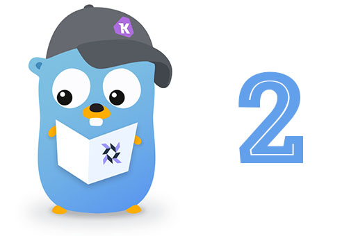
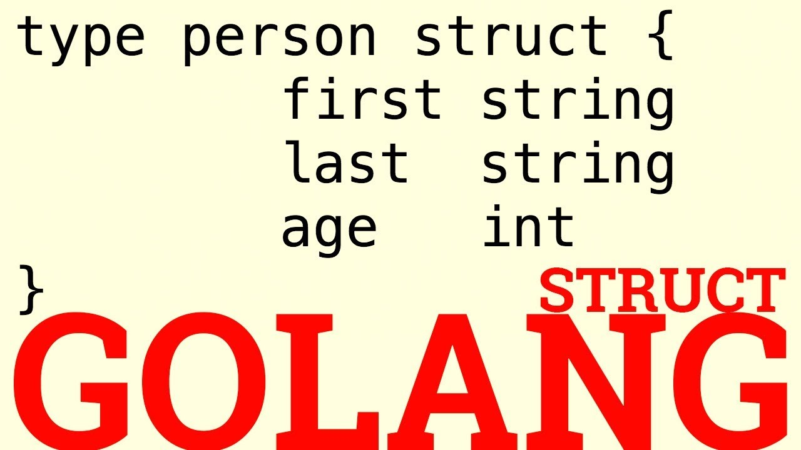
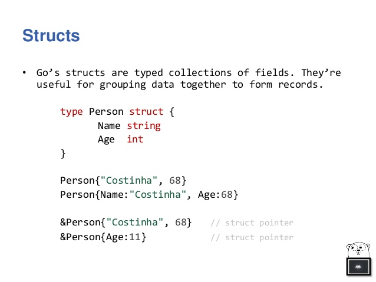
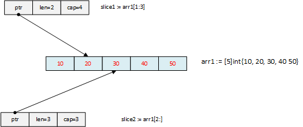
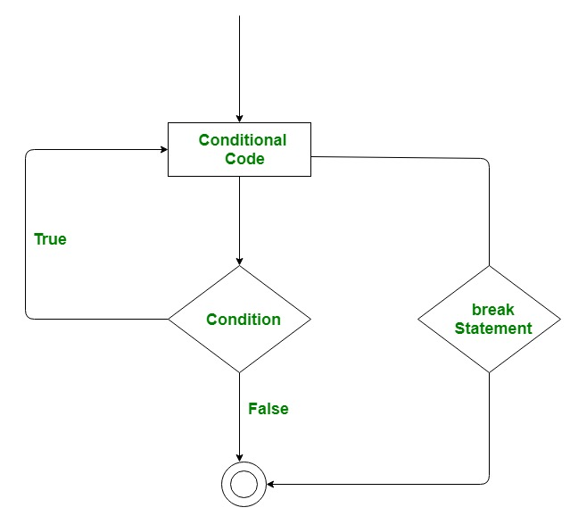

# Golang

+ is a general purpose, statically typed, strongly typed programming language.

+ was initially developed at Google in year 2007 by Robert Griesemer, Rob Pike & Ken Thompson.

+ provides inbuilt support for Garbage collection and supports concurrent programming.

<h2 id='features'> Features</h2> 

+ Compilation time is fast.

+ Inbuilt concurrency support. 

+ Programs are simple, concise and safe.

+ Production of statically linked native binaries without external dependencies.

+ Support for environment adpting patterns similar to dynamic languages (e.g. x := 0).

<!-- Gopher image -->


<h2 id='tokens'>Tokens in Golang</h2>

is either 

+ a keyword (`fmt`, `import` etc.)

+ an identifier (`fullname`, `age`, `GetAge` etc.)

+ a string literal (`"Rishikesh Agrawani"`, `"Twenty Six"`)

+ a constant (`26`, `3.14` etc.)

+ a symbol (`+`, `(`, `}` etc.)

<h2 id='examples'> Examples</h2>

Have a look at the following examples one by one. I think it would be very easy for you to understand as it is very simple and most of the lines are commented.

<h3 id='1'>Writing a simple hello world program</h3>

```go
/**
    {
        "created": "5 Feb 2019, Tue",
        "aim": "Writing a simple hello world program",
        "codedBy": "Rishikesh Agrawani"
    }
*/

// package declaration (required)
package main

// import statement (importing "fmt" package)
import "fmt"

// main() function definition
func main() {
    // Writing message to console using "Println()" function defined in "fmt" package
    fmt.Println("Hello programmers, this is really a great chance to learn Golang")
}

```

> **Output**

```bash
Rishikeshs-MacBook-Air:basic hygull$ pwd
/Users/hygull/Projects/Golang/golang/basic
Rishikeshs-MacBook-Air:basic hygull$ 
Rishikeshs-MacBook-Air:basic hygull$ ls
helloworld.go
Rishikeshs-MacBook-Air:basic hygull$ go run helloworld.go 
Hello programmers, this is really a great chance to learn Golang

```

<h3 id='2'>Creating variables in Golang (using 4 commnly used styles)</h3>

```go
/**
    {
        "created": "5 Feb 2019, Tue",
        "aim": "creating variables in Golang (using 4 commnly used styles)",
        "codedBy": "Rishikesh Agrawani"
    }
*/

package main

import "fmt"

func main() {
    // 1st
    // defining type of variable a as int
    var a int 
    // initialization of variable a (assignment)
    a = 1729

    // 2nd
    // creating 2/more variables in a single statement (using above style/approach)
    var c, d float64 = 34.56, 3.14

    // 3rd
    // creating variable b in a single statement
    b := 67

    // 4th
    // creating 2/more variables in a single statement (using 3rd approach)
    fullname, age := "Rishikesh Agrawani", 26

    // printing values of all variables
    fmt.Println(a, b, c, d) // 1729 67 34.56 3.14
    fmt.Printf("%s, %d\n", fullname, age) // Rishikesh Agrawani, 26
}

```

> Output

```bash
Rishikeshs-MacBook-Air:basic hygull$ go run variables.go 
1729 67 34.56 3.14
Rishikesh Agrawani, 26

```

<h3 id='3'>Working with strings</h3>

```go
/**
    {
        "created": "6 Feb 2019, Wed",
        "aim": "Working with strings",
        "codedBy": "Rishikesh Agrawani"
    }
*/

package main

import "fmt"

func main() {
    var fullname string = "Rishikesh Agrawani" // creating string
    city := "Bangalore" // direct way of creating string

    fmt.Printf("My fullname is %s and I live in %s\n", fullname, city)
}
```

> Output

```bash
Rishikeshs-MacBook-Air:basic hygull$ go run strings.go 
My fullname is Rishikesh Agrawani and I live in Bangalore

```

<h3 id='4'>Working with if else statements</h3>

<!-- If-else image -->


```go
/**
    {
        "created": "7 Feb 2019, Thu",
        "aim": "Working with if else statements",
        "codedBy": "Rishikesh Agrawani"
    }
*/

package main

import "fmt"

func main() {
    var age = 26
    var maxAge int = 100
    var firstName string = "Rishikesh"

    // If statement
    if( age < maxAge ) {
        fmt.Printf("I am still young as my age is %d and it is <= %d\n", age, maxAge)
    }

    // If else statement
    length := len(firstName)
    message := "My first name %s contains"
    message2 := "than %d characters"

    if( length > 10 ) {
        fmt.Printf(fmt.Sprintf("%s greater %s\n", message, message2), firstName, length)
    } else {
        fmt.Printf(fmt.Sprintf("%s less %s\n", message, message2), firstName, length)
    }

    // If else...if else statement
    var a, b, c = 12, 67, 87

    if( a > b ) { // Evaluates to false
        fmt.Printf("I am in 2nd floor")
    } else if( a > c ) { // Evaluates to false
        fmt.Printf("I am in 1st floor")
    } else {
        fmt.Printf("I am in ground floor") // So, it will be executed
    }

    fmt.Printf("\n")
}

```

> Output

```bash
Rishikeshs-MacBook-Air:basic hygull$ go run if_else.go 
I am still young as my age is 26 and it is <= 100
My first name Rishikesh contains less than 9 characters
I am in ground floor

```

<h3 id="struct">Working with structure in Golang</h3>

| struct | struct pointer |
| --- | --- |
|  |  |

```go
/**
    {
        "created": "16 Feb 2019, Sat",
        "aim": "Working with structure in Golang",
        "codedBy": "Rishikesh Agrawani",
        "reference": "http://www.golangprograms.com/how-to-get-struct-variable-information-using-reflect-package.html"
    }
*/

package main

import "fmt"
import "reflect"

// Defining a structure named Car to define the structure of car object

// Note: Make sure you have already capitalized struct filed names
// It's for iterating over it, and using Interface() method will cause error, if names are not capitalized
// eg. panic: reflect.Value.Interface: cannot return value obtained from unexported field or method
// (If we used 'name' in place of 'Name')
type Car struct {
    Name string             
    Wheels int8             
    Price float64
    Color string
    Models []string
    PriceOptions []float64
    OfficialWebsite string
}

func main() {
    // - Create a structure object
    // - Even the data are not in order (below) as they appear (above)
    // but final output will follow the order defined its structure  
    bugatti := Car{
        Name: "Bugatti",
        Wheels: 4, // 4 will be of type int8 (here)
        Price: 40000000.58,
        PriceOptions: []float64{120, 130, 500},
        Color: "Red",
        Models: []string{"Type 57 SC Atlantic", "Type 41 Royale", "Vision Gran Turismo", "Chiron"},
        OfficialWebsite: "https://www.bugatti.com/home/",
    }

    // Printing structure
    fmt.Println(bugatti)

    // Accessing structure
    fmt.Println(bugatti.Name) // Bugatti

    // Checcking type
    fmt.Println(reflect.TypeOf(bugatti.Wheels)) // int8

    // Iterating over field of struct in Golang
    elem := reflect.ValueOf(&bugatti).Elem()
    fmt.Println("Elem: ", elem, "\n")

    for i := 0; i < elem.NumField(); i++ {
        name := elem.Type().Field(i).Name 
        typ := elem.Type().Field(i).Type 
        value := elem.Field(i).Interface()

        fmt.Println("Name:", name, "Type:", typ, "Value:", value)
    }
}

```

> Output

```bash
Rishikeshs-MacBook-Air:basic hygull$ go run struct.go 
{Bugatti 4 4.000000058e+07 Red [Type 57 SC Atlantic Type 41 Royale Vision Gran Turismo Chiron] [120 130 500] https://www.bugatti.com/home/}
Bugatti
int8
Elem:  {Bugatti 4 4.000000058e+07 Red [Type 57 SC Atlantic Type 41 Royale Vision Gran Turismo Chiron] [120 130 500] https://www.bugatti.com/home/} 

Name: Name Type: string Value: Bugatti
Name: Wheels Type: int8 Value: 4
Name: Price Type: float64 Value: 4.000000058e+07
Name: Color Type: string Value: Red
Name: Models Type: []string Value: [Type 57 SC Atlantic Type 41 Royale Vision Gran Turismo Chiron]
Name: PriceOptions Type: []float64 Value: [120 130 500]
Name: OfficialWebsite Type: string Value: https://www.bugatti.com/home/

```

<h3 id='5'>Working with loops (3 basic forms)</h3>

```go
/**
    {
        "created": "7 Feb 2019, Thu",
        "aim": "Working on loops (3 basic forms)",
        "codedBy": "Rishikesh Agrawani"
    }
*/

package main

import "fmt"

func main() {
    // for loop - 1st form
    for i := 1; i <= 3; i++ {
        fmt.Println(i)
    }

    fmt.Println() // new line

    // for loop - 2nd form
    j := 1
    for j <= 3 {
        fmt.Println(j + 2)
        j++
    }

    fmt.Println() // new line

    // for loop - 3rd form
    arr := [5]int{1, 4, 5, 6, 67} // an array of integers of 5 elements 
    for index, item := range arr {
        fmt.Println(index, item) 
    }

    fmt.Println() // new line

    // Nested for loop
    for i := 1; i <= 4; i = i + 2 {  // i => 1, 3
        for j := 1; j <= 4; j += 2 { // j => 1, 3
            fmt.Println(i + j)       // 1 + 1, 1 + 3 | 3 + 1, 3 + 3 => 2, 4 | 4, 6
        }
    } 
}

```

> Output

```bash
Rishikeshs-MacBook-Air:basic hygull$ go run loops.go 
1
2
3

3
4
5

0 1
1 4
2 5
3 6
4 67

2
4
4
6

```

<h3 id='json-enc'>Working with encoding of struct to JSON</h3>

```go
/**
    {
        "created": "8 Feb 2019, Fri",
        "aim": "Working with encoding of struct to JSON",
        "codedBy": "Rishikesh Agrawani",
        "reference": "https://golang.org/pkg/encoding/json/#MarshalIndent"
    }
*/

package main

import "fmt"
import "encoding/json"  

func main() {
    // Defining a struture
    type Person struct {
        Name string         `json:"name"`
        Age int8            `json:"age"`
        Profession string   `json:"profession"`
        Address string      `json:"address"`
        Languages []string  `json:"languages"`
    }

    // Initializing structure
    rishikesh := Person{
                    Name: "Rishikesh",
                    Age: 26, Profession: "Python/Django developer",
                    Address: "Bangalore, India",
                    Languages: []string{"Python", "JavaScript", "Golang"}, // , is must here
                }

    details, _ := json.MarshalIndent(&rishikesh, "", "\t") // pointer to struct, prefix, indent
    fmt.Println(string(details))
}

```
> Output

```bash
Rishikeshs-MacBook-Air:basic hygull$ go run json_encoding.go 
{
    "name": "Rishikesh",
    "age": 26,
    "profession": "Python/Django developer",
    "address": "Bangalore, India",
    "languages": [
        "Python",
        "JavaScript",
        "Golang"
    ]
}

```

<h3 id='json_dec'>Working on decoding of JSON</h3>

```go
/**
    {
        "created": "8 Feb 2019, Fri",
        "aim": "Working on decoding of JSON",
        "codedBy": "Rishikesh Agrawani",
        "reference": "https://golang.org/pkg/encoding/json/#MarshalIndent"
    }
*/

package main

import "fmt"
import "encoding/json"


func main() {
    // Creating a simple JSON string containing a person details
    jsonDetailsString := `{
                            "fullname": "Rishikesh Agrawani",
                            "age": 26,
                            "profession": "Python/Django developer",
                            "company": "MoneyBloom",
                            "languages": [
                                "Python", "JavaScript", "Golang"
                            ],
                            "isActive": true
                        }`

    // Defining a data structure to represent the decoded object
    type Person struct {
        Fullname string
        Age int8
        Profession string
        Company string 
        Languages []string
        IsActive bool
    }

    // Print values only
    details := Person{}
    err := json.Unmarshal([]byte(jsonDetailsString), &details)

    if err != nil {
        panic(err)
    }
    fmt.Println(details, "\n")

    // Print with keys & values both 
    var detailsPretty map[string]interface{}
    err = json.Unmarshal([]byte(jsonDetailsString), &detailsPretty)

    if err != nil {
        panic(err)
    }
    fmt.Println(detailsPretty)
}

```

> Output

```bash
Rishikeshs-MacBook-Air:basic hygull$ go run json_decoding.go 
{Rishikesh Agrawani 26 Python/Django developer MoneyBloom [Python JavaScript Golang] true} 

map[age:26 profession:Python/Django developer company:MoneyBloom languages:[Python JavaScript Golang] isActive:true fullname:Rishikesh Agrawani]

```

<h3 id='cmd-args'>Working with command line arguments</h3>

```go
/**
    {
        "created": "9 Feb 2019, Sat",
        "aim": "Working with command line arguments",
        "codedBy": "Rishikesh Agrawani"
    }
*/

package main

import "fmt"
import "os"

func main() {
    // Getting raw command line arguments
    rawArguments := os.Args
    fmt.Println(rawArguments)

    // Getting list of supplied arguments from command line
    suppliedArguments := rawArguments[1:]
    fmt.Println(suppliedArguments)
}

```

> Output

```bash
Rishikeshs-MacBook-Air:basic hygull$ go run command_line_args.go 67 56
[/var/folders/_h/d17s0sg11q74f68sxqnvg1nm0000gn/T/go-build148913680/b001/exe/command_line_args 67 56]
[67 56]
Rishikeshs-MacBook-Air:basic hygull$ 
Rishikeshs-MacBook-Air:basic hygull$ go build command_line_args.go 
Rishikeshs-MacBook-Air:basic hygull$ ./command_line_args 67 56
[./command_line_args 67 56]
[67 56]
Rishikeshs-MacBook-Air:basic hygull$ 

```

<h3 id=''>Calculating sum of all valid integers passed from command line</h3>

```go
/**
    {
        "created": "9 Feb 2019, Sat",
        "aim": "Calculating sum of all valid integers passed from command line",
        "codedBy": "Rishikesh Agrawani"
    }
*/

package main

import "fmt"
import "os"
import "strconv"

func main() {
    args := os.Args[1:]

    if len(args) == 0 {
        fmt.Println("You forgot to supply integers from command line")
    } else {
        fmt.Println("Go supplied integers as", args)
        var sum int

        for i := 0; i < len(args); i++ {
            data, err := strconv.Atoi(args[i])
            
            if(err == nil) { // Curley braces are required unike JavaScript otherwise
                             // syntax error: assignment sum += data used as value
                sum += data
            } else {
                panic(err)
            }
        } 
        fmt.Println("Sum =", sum)
    }
}

```

> Output

```bash
Rishikeshs-MacBook-Air:basic hygull$ go run command_line_sum_args_.go 12 34
Go supplied integers as [12 34]
Sum = 46
Rishikeshs-MacBook-Air:basic hygull$ go run command_line_sum_args_.go 12 34 1 6 -1
Go supplied integers as [12 34 1 6 -1]
Sum = 52
Rishikeshs-MacBook-Air:basic hygull$ go run command_line_sum_args_.go -1 -2 -3 -4 -5
Go supplied integers as [-1 -2 -3 -4 -5]
Sum = -15
Rishikeshs-MacBook-Air:basic hygull$ go run command_line_sum_args_.go -1 -2 0 2 1
Go supplied integers as [-1 -2 0 2 1]
Sum = 0

```

<h3 id=''>Working with inetfaces</h3>

```go
/**
{
    "created": "10 Feb 2019, Sun",
    "aim": "Working with inetfaces",
    "codedBy": "Rishikesh Agrawani"
}
*/

package main

import "fmt"

// import "reflect"

// Defining an interface
type Person interface {
    getFullname() string
    getAge() int8
    getInterests() []string
    showDetails()
}

type CommonDetail struct {
    fullname  string
    age       int8
    interests []string
}

// Defining a structure named Student
type Student struct {
    detail  CommonDetail
    college string
}

// Defining a structure named Employee
type Employee struct {
    detail CommonDetail
    salary float64
}

func (student Student) getFullname() string {
    return student.detail.fullname
}

func (employee Employee) getFullname() string {
    return employee.detail.fullname
}

func (student Student) getAge() int8 {
    return student.detail.age
}

func (employee Employee) getAge() int8 {
    return employee.detail.age
}

func (student Student) getInterests() []string {
    return student.detail.interests
}

func (employee Employee) getInterests() []string {
    return employee.detail.interests
}

func showCommonDetails(object interface{}, typ string) {
    // var o interface{}

    if typ == "student" { // do not use type (predefined)
        student, _ := object.(Student)

        fmt.Println("Fullname:", student.detail.fullname)
        fmt.Println("Age:", student.detail.age)
        fmt.Println("Interests:", student.detail.interests)
    } else if typ == "employee" {
        employee, _ := object.(Employee)

        fmt.Println("Fullname:", employee.detail.fullname)
        fmt.Println("Age:", employee.detail.age)
        fmt.Println("Interests:", employee.detail.interests)
    }
}

func (student Student) showDetails() {
    showCommonDetails(student, "student")
    fmt.Println("School: ", student.college, "\n")
}

func (employee Employee) showDetails() {
    showCommonDetails(employee, "employee")
    fmt.Println("Salary: ", employee.salary, "\n")
}

func getDetails(person Person) {
    person.showDetails()
}

func main() {
    // Student
    studentDetail := CommonDetail{
        fullname:  "Malinikesh Agrawani",
        age:       22,
        interests: []string{"Reading Books", "Watching TV", "Cooking"},
    }

    student := Student{
        detail:  studentDetail,
        college: "Govt. Nagarjuna Science college, Raipur",
    }

    fmt.Println(student)
    student.showDetails()

    // Employee
    employeeDetail := CommonDetail{
        fullname: "Raghvendra Thakur",
        age:      26,
        interests: []string{
            "Programming", "Reading Books",
            "Watching animated movies", "Writing hindi/english poems",
        },
    }

    employee := Employee{
        detail: employeeDetail,
        salary: 5000000,
    }

    fmt.Println(employee)
    employee.showDetails()
}

```

> Output

Please have a look at [this](./docs/markdowns/interfaces-output.txt) to view the output.

**Note:** The main reason to place the oupput fo this program is to pass the tests made by Github pages. The output contains 2 left curley braces which becomes the reason for failure in the tests performed by Github pages.


<h3 id="maps">Working with maps in Golang</h3>

```go
/**
    {
        "created": "12 Feb 2019, Tue",
        "aim": "Working with maps in Golang",
        "codedBy": "Rishikesh Agrawani"
    }
*/

package main

import "fmt"

func main() {
    // Creating a map (string as keys, integers as values)

    /*** 1st way ***/
    numbers := make(map[string]int) // Unordered data structure

    numbers["one"] = 1
    numbers["two"] = 2
    numbers["ten"] = 10
    numbers["three"] = 3
    fmt.Println(numbers)

    // Deleting 3rd entry from the map
    delete(numbers, "ten")
    fmt.Println(numbers)

    // Accessing entries
    fmt.Println(numbers["one"])
    val, exists := numbers["two"] // Here, return arguments `exists` is optional 
    fmt.Println(val, exists)

    /*** 2nd way ***/
    cities := map[string]string{"city1": "Bangalore", "city2": "Raipur", "city3": "Kondagaon"}
    fmt.Println(cities)
    fmt.Println(cities["city1"])
}

```

> Output

```bash
Rishikeshs-MacBook-Air:basic hygull$ go run maps.go 
map[one:1 two:2 ten:10 three:3]
map[one:1 two:2 three:3]
1
2 true
map[city2:Raipur city3:Kondagaon city1:Bangalore]
Bangalore
```

<h3 id="arrays">Working with arrays in Golang</h3>

| Arrays & slices (example 1) | Arrays & slices (example 2)|
| --- | --- |
|  |  |

```go
/**
{
    "created": "15 Feb 2019, Fri",
    "aim": "Working with arrays in Go",
    "codedBy": "Rishikesh Agrawani",
    "reference": "https://tour.golang.org/moretypes/6"
}
*/

package main

import (
    "fmt"
    "reflect"
)

func main() {
    // Creating an array of 5 integers (Note: Array is of fixed size unlike slices)
    var numbers [5]int

    numbers[0] = 0
    numbers[1] = -67
    numbers[2] = 43

    // Printing the above array
    fmt.Println(numbers) // Last 2 array positions (3 & 4)
    // will have the zero value of integer i.e. 0 (again)

    // Creating an array of 3 strings by initializing them in the same statement
    scientists := [3]string{"Albert Einstein", "Dr. Homi Jenhagir Bhabha", "Sir Issac Newton"}

    // Printing the above array of strings
    fmt.Println(scientists)

    // Accessing contents of arrays
    fmt.Println(numbers[2])    // 43
    fmt.Println(scientists[1]) // Dr. Homi Jenhagir Bhabha

    // Calculating length of arrays
    fmt.Println("len(scientists) = ", len(scientists))
    fmt.Println("len(numbers) = ", len(numbers))

    // Checking type of arrays
    fmt.Println(reflect.TypeOf(scientists)) // [3]string
    fmt.Println(reflect.TypeOf(numbers))    // [5]int

    // Slicing arrays
    slice1 := scientists[1:len(scientists)] // 1:3 => 1, 2 (indices)
    slice2 := numbers[2:5]                  // 2:5 => 2, 3, 4 (indices)

    // Printing created slices
    fmt.Println(slice1)
    fmt.Println(slice2)

    // Checking type of slices
    fmt.Println(reflect.TypeOf(slice1)) // []string
    fmt.Println(reflect.TypeOf(slice2)) // []int
}

```

> Output

```bash
Rishikeshs-MacBook-Air:basic hygull$ go run arrays.go 
[0 -67 43 0 0]
[Albert Einstein Dr. Homi Jenhagir Bhabha Sir Issac Newton]
43
Dr. Homi Jenhagir Bhabha
len(scientists) =  3
len(numbers) =  5
[3]string
[5]int
[Dr. Homi Jenhagir Bhabha Sir Issac Newton]
[43 0 0]
[]string
[]int

```


<h3 id="slices">Use of slice data structure in Golang</h3>

| Go slices, length, capacity | slicing example |
| --- | --- |
|  | |

```go
/**
    {
        "created": "13 Feb 2019, Wed",
        "aim": "Use of slice data structure in Golang",
        "codedBy": "Rishikesh Agrawani"
        "references": [
            "https://blog.golang.org/go-slices-usage-and-internals",
            "https://flaviocopes.com/go-empty-interface/"
        ]
    }
*/

package main

import "fmt"

func printCapacityAndLength(cities interface{}) {
    // Printing capacity & length of slice
    switch cities.(type) {
        case []int:
            fmt.Println("Case 1, []int")
            v, _ := cities.([]int)
            fmt.Println(cap(v), len(v)) 
        case []string:
            fmt.Println("Case 2, []string")
            v, _ := cities.([]string)
            fmt.Println(cap(v), len(v)) 
        default:
            fmt.Println("Catch does not match")
    }
}

func main() {
    // Creating slice of strings
    cities := []string{
                "Bangalore", "Raipur",
                "Kondagaon", "Bilaspur",
            }

    // Printing slice
    fmt.Println(cities)

    // Calculating total number of cities (strings) in slice
    fmt.Println("Total cities: ", len(cities))
    printCapacityAndLength(cities)

    // Appending 1|more cit(y|ies) to the slice, 
    // printing length & capacity after each append operation
    cities = append(cities, "Gurgaon")
    printCapacityAndLength(cities)

    cities = append(cities, "Silicon Valley", "Hyderabad")
    fmt.Println("After addition of 3 more cities: ", cities)
    printCapacityAndLength(cities)

    // Creating another slice of villages
    villages := []string{"Bedagaon", "Badedongar"}

    // Appending all villages to cities (assume these villages turned to cities)
    cities = append(cities, villages...)
    fmt.Println("After addition of 2 more villages(in cities): ", cities)
    printCapacityAndLength(cities)

    // Slicing 
    first3cities := cities[:3]
    fmt.Println("First 3 cities: ", first3cities)

    last3cities := cities[len(cities) - 3: len(cities)]
    fmt.Println("Last 3 cities: ", last3cities)

    fmt.Println("Working on slices of integers")
    // Using copy() function (evens & odds, the slices of integers)
    evens := make([]int, 3, 5)
    odds := []int{12, 45, 67, 89, 21}
    integers := make([]int, len(evens) + len(odds))
    printCapacityAndLength(evens)
    printCapacityAndLength(odds)
    printCapacityAndLength(integers)
    /* 
        func copy(dst, src []T) int
        ---
        ret == number of elements copied
    */
    ret := copy(integers, odds)
    fmt.Println(integers)
    ret = copy(integers, evens)
    fmt.Println(integers, ret)
}

```

> Output

```bash
Rishikeshs-MacBook-Air:golang hygull$ go run basic/slices.go 
[Bangalore Raipur Kondagaon Bilaspur]
Total cities:  4
Case 2, []string
4 4
Case 2, []string
8 5
After addition of 3 more cities:  [Bangalore Raipur Kondagaon Bilaspur Gurgaon Silicon Valley Hyderabad]
Case 2, []string
8 7
After addition of 2 more villages(in cities):  [Bangalore Raipur Kondagaon Bilaspur Gurgaon Silicon Valley Hyderabad Bedagaon Badedongar]
Case 2, []string
16 9
First 3 cities:  [Bangalore Raipur Kondagaon]
Last 3 cities:  [Hyderabad Bedagaon Badedongar]
Working on slices of integers
Case 1, []int
5 3
Case 1, []int
5 5
Case 1, []int
8 8
[12 45 67 89 21 0 0 0]
[0 0 0 89 21 0 0 0] 3

```

<h3 id="break">Using break statement in Go</h3>



```go
/**
{
    "created": "14 Feb 2019, ",
    "aim": "Using break statement in Golang",
    "codedBy": "Rishikesh Agrawani"
}
*/

package main

import "fmt"

func printNumberPairs(useBreak bool) {
    i := 1
    // Outer for loop
    for i <= 5 {
        j := 1
        // Inner for loop
        for j <= 5 {
            if useBreak {
                if j == 4 {
                    break
                }
            }
            fmt.Print("(", i, j, ")", " ")

            j += 1 // += operator increments value of j by 1
        }
        fmt.Println()
        i++ // Post increment of value of i by 1
    }
}

func main() {
    userBreaks := []bool{true, false}
    var msg string = ""

    for index, useBreak := range userBreaks {
        if index == 1 {
            msg = "without "
        }

        msg += "using break statement"
        fmt.Println(msg)

        printNumberPairs(useBreak)
        fmt.Println()
    }
}

```

> Output

```bash
Rishikeshs-MacBook-Air:basic hygull$ go run break.go 
using break statement
(1 1) (1 2) (1 3) 
(2 1) (2 2) (2 3) 
(3 1) (3 2) (3 3) 
(4 1) (4 2) (4 3) 
(5 1) (5 2) (5 3) 

without using break statement
(1 1) (1 2) (1 3) (1 4) (1 5) 
(2 1) (2 2) (2 3) (2 4) (2 5) 
(3 1) (3 2) (3 3) (3 4) (3 5) 
(4 1) (4 2) (4 3) (4 4) (4 5) 
(5 1) (5 2) (5 3) (5 4) (5 5) 

```
<h3 id='references'>References</h3>

The following are the list of urls of websites where you can go and try to learn & clear concepts of Golang.

These are really excellent to teach and make you understand Go as I have experienced and still I'm experiencing.

- [x] A tour of Golang - [https://tour.golang.org/welcome/1](https://tour.golang.org/welcome/1)

- [x] Dotnetperls - [https://www.dotnetperls.com/#go](https://www.dotnetperls.com/#go)

- [x] Tutorialspoint - [https://www.tutorialspoint.com/go/index.htm](https://www.tutorialspoint.com/go/index.htm)

- [x] GoByExample - [https://gobyexample.com](https://gobyexample.com)

- [x] How to write Go code - [https://golang.org/doc/code.html](https://golang.org/doc/code.html)

- [x] Code organization - [https://golang.org/doc/code.html#Organization](https://golang.org/doc/code.html#Organization)

- [x] GOPATH setting - [https://github.com/golang/go/wiki/SettingGOPATH](https://github.com/golang/go/wiki/SettingGOPATH)

- [x] Slides -[https://talks.golang.org/2013/bestpractices.slide#1](https://talks.golang.org/2013/bestpractices.slide#1)

- [x] Effective Go - [https://golang.org/doc/effective_go.html](https://golang.org/doc/effective_go.html)

- [x] Go best practices - Error handling [https://medium.com/@sebdah/go-best-practices-error-handling-2d15e1f0c5ee](https://medium.com/@sebdah/go-best-practices-error-handling-2d15e1f0c5ee)

- [x] Top 30 Go tutorials - [https://stackify.com/learn-go-tutorials/](https://stackify.com/learn-go-tutorials/)

- [x] Append strings in Golang - [https://christopher.su/notes/go/append-strings/](https://christopher.su/notes/go/append-strings/)

- [x] Arrays - [https://tour.golang.org/moretypes/6](https://tour.golang.org/moretypes/6)

- [x] 2D arrays - [https://gobyexample.com/arrays](https://gobyexample.com/arrays)

- [x] Getting information about struct variable in Go - [http://www.golangprograms.com/how-to-get-struct-variable-information-using-reflect-package.html](http://www.golangprograms.com/how-to-get-struct-variable-information-using-reflect-package.html)
