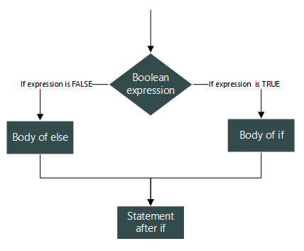

# Golang

+ is a general purpose, statically typed, strongly typed programming language.

+ was initially developed at Google in year 2007 by Robert Griesemer, Rob Pike & Ken Thompson.

+ provides inbuilt support for Garbage collection and supports concurrent programming.

<h2 id='features'> Features</h2> 

+ Compilation time is fast.

+ Inbuilt concurrency support. 

+ Programs are simple, concise and safe.

+ Production of statically linked native binaries without external dependencies.

+ Support for environment adpting patterns similar to dynamic languages (e.g. x := 0).

<!-- Gopher image -->


<h2 id='tokens'>Tokens in Golang</h2>

is either 

+ a keyword (`fmt`, `import` etc.)

+ an identifier (`fullname`, `age`, `GetAge` etc.)

+ a string literal (`"Rishikesh Agrawani"`, `"Twenty Six"`)

+ a constant (`26`, `3.14` etc.)

+ a symbol (`+`, `(`, `}` etc.)

<h2 id='examples'> Examples</h2>

Have a look at the following examples one by one. I think it would be very easy for you to understand as it is very simple and most of the lines are commented.

<h3 id='1'>Writing a simple hello world program</h3>

```go
/**
    {
        "created": "5 Feb 2019, Tue",
        "aim": "Writing a simple hello world program",
        "codedBy": "Rishikesh Agrawani"
    }
*/

// package declaration (required)
package main

// import statement (importing "fmt" package)
import "fmt"

// main() function definition
func main() {
    // Writing message to console using "Println()" function defined in "fmt" package
    fmt.Println("Hello programmers, this is really a great chance to learn Golang")
}

```

> **Output**

```bash
Rishikeshs-MacBook-Air:basic hygull$ pwd
/Users/hygull/Projects/Golang/golang/basic
Rishikeshs-MacBook-Air:basic hygull$ 
Rishikeshs-MacBook-Air:basic hygull$ ls
helloworld.go
Rishikeshs-MacBook-Air:basic hygull$ go run helloworld.go 
Hello programmers, this is really a great chance to learn Golang

```

<h3 id='2'>Creating variables in Golang (using 4 commnly used styles)</h3>

```go
/**
    {
        "created": "5 Feb 2019, Tue",
        "aim": "creating variables in Golang (using 4 commnly used styles)",
        "codedBy": "Rishikesh Agrawani"
    }
*/

package main

import "fmt"

func main() {
    // 1st
    // defining type of variable a as int
    var a int 
    // initialization of variable a (assignment)
    a = 1729

    // 2nd
    // creating 2/more variables in a single statement (using above style/approach)
    var c, d float64 = 34.56, 3.14

    // 3rd
    // creating variable b in a single statement
    b := 67

    // 4th
    // creating 2/more variables in a single statement (using 3rd approach)
    fullname, age := "Rishikesh Agrawani", 26

    // printing values of all variables
    fmt.Println(a, b, c, d) // 1729 67 34.56 3.14
    fmt.Printf("%s, %d\n", fullname, age) // Rishikesh Agrawani, 26
}

```

> Output

```bash
Rishikeshs-MacBook-Air:basic hygull$ go run variables.go 
1729 67 34.56 3.14
Rishikesh Agrawani, 26

```

<h3 id='3'>Working with strings</h3>

```go
/**
    {
        "created": "6 Feb 2019, Wed",
        "aim": "Working with strings",
        "codedBy": "Rishikesh Agrawani"
    }
*/

package main

import "fmt"

func main() {
    var fullname string = "Rishikesh Agrawani" // creating string
    city := "Bangalore" // direct way of creating string

    fmt.Printf("My fullname is %s and I live in %s\n", fullname, city)
}
```

> Output

```bash
Rishikeshs-MacBook-Air:basic hygull$ go run strings.go 
My fullname is Rishikesh Agrawani and I live in Bangalore

```

<h3 id='4'>Working with if else statements</h3>

<!-- If-else image -->


```go
/**
    {
        "created": "7 Feb 2019, Thu",
        "aim": "Working with if else statements",
        "codedBy": "Rishikesh Agrawani"
    }
*/

package main

import "fmt"

func main() {
    var age = 26
    var maxAge int = 100
    var firstName string = "Rishikesh"

    // If statement
    if( age < maxAge ) {
        fmt.Printf("I am still young as my age is %d and it is <= %d\n", age, maxAge)
    }

    // If else statement
    length := len(firstName)
    message := "My first name %s contains"
    message2 := "than %d characters"

    if( length > 10 ) {
        fmt.Printf(fmt.Sprintf("%s greater %s\n", message, message2), firstName, length)
    } else {
        fmt.Printf(fmt.Sprintf("%s less %s\n", message, message2), firstName, length)
    }

    // If else...if else statement
    var a, b, c = 12, 67, 87

    if( a > b ) { // Evaluates to false
        fmt.Printf("I am in 2nd floor")
    } else if( a > c ) { // Evaluates to false
        fmt.Printf("I am in 1st floor")
    } else {
        fmt.Printf("I am in ground floor") // So, it will be executed
    }

    fmt.Printf("\n")
}

```

> Output

```bash
Rishikeshs-MacBook-Air:basic hygull$ go run if_else.go 
I am still young as my age is 26 and it is <= 100
My first name Rishikesh contains less than 9 characters
I am in ground floor

```
<h3 id='5'>Working with loops (3 basic forms)</h3>

```go
/**
    {
        "created": "7 Feb 2019, Thu",
        "aim": "Working on loops (3 basic forms)",
        "codedBy": "Rishikesh Agrawani"
    }
*/

package main

import "fmt"

func main() {
    // for loop - 1st form
    for i := 1; i <= 3; i++ {
        fmt.Println(i)
    }

    fmt.Println() // new line

    // for loop - 2nd form
    j := 1
    for j <= 3 {
        fmt.Println(j + 2)
        j++
    }

    fmt.Println() // new line

    // for loop - 3rd form
    arr := [5]int{1, 4, 5, 6, 67} // an array of integers of 5 elements 
    for index, item := range arr {
        fmt.Println(index, item) 
    }

    fmt.Println() // new line

    // Nested for loop
    for i := 1; i <= 4; i = i + 2 { // i => 1, 3
        for j := 1; j <= 4; j += 2 { // j => 1, 3
            fmt.Println(i + j) // 1 + 1, 1 + 3 | 3 + 1, 3 + 3 => 2, 4 | 4, 6
        }
    } 
}

```

> Output

```bash
Rishikeshs-MacBook-Air:basic hygull$ go run loops.go 
1
2
3

3
4
5

0 1
1 4
2 5
3 6
4 67

2
4
4
6

```


<h3 id='references'>References</h3>

The following are the list of urls of websites where you can go and try to learn & clear concepts of Golang.

These are really excellent to teach and make you understand Go as I have experienced and still I'm experiencing.

- [x] A tour of Golang - [https://tour.golang.org/welcome/1](https://tour.golang.org/welcome/1)

- [x] Dotnetperls - [https://www.dotnetperls.com/#go](https://www.dotnetperls.com/#go)

- [x] Tutorialspoint - [https://www.tutorialspoint.com/go/index.htm](https://www.tutorialspoint.com/go/index.htm)

- [x] GoByExample - [https://gobyexample.com](https://gobyexample.com)

- [x] How to write Go code - [https://golang.org/doc/code.html](https://golang.org/doc/code.html)

- [x] Code organization - [https://golang.org/doc/code.html#Organization](https://golang.org/doc/code.html#Organization)

- [x] GOPATH setting - [https://github.com/golang/go/wiki/SettingGOPATH](https://github.com/golang/go/wiki/SettingGOPATH)
